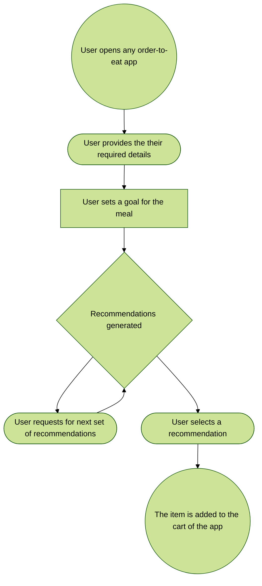
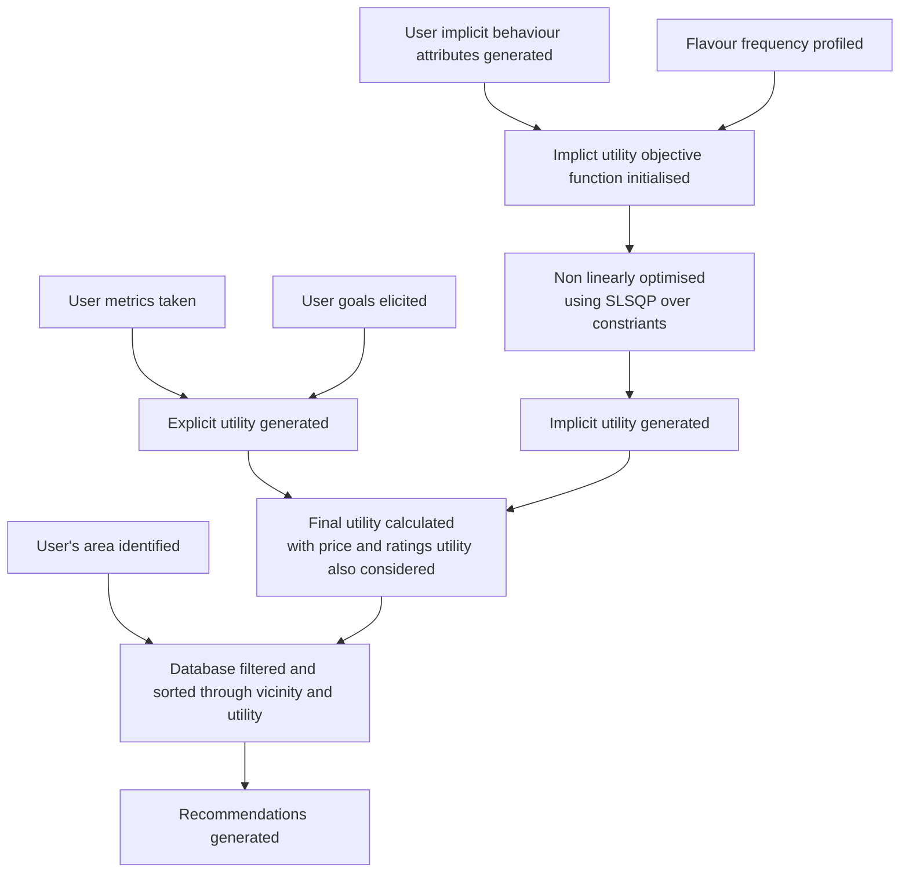
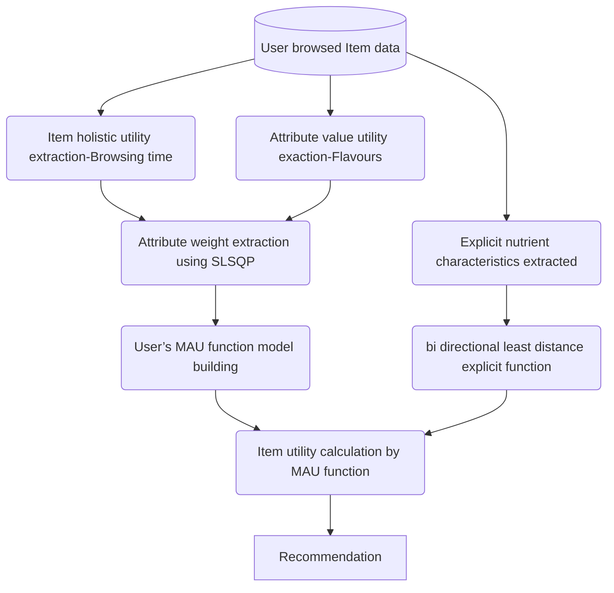

Making food recommendations easy! 

#### _EasyEats is a proud part of [FoodStats](https://github.com/FoodStats)_ ####

## Context 🤔
Due to fast-paced and long work environments, people are struggling to pay due to attention to their meals.
Most of these meals are **ready-to-eat either delivered** by restaurants or **packaged meals** from convinience stores. 
Due to the purpose of these meals they **cannot be a substitute for a balance diet**; Especially if they are consumed without dietary planning.
This can be contributed to high amounts of calories, fat, sugar, and sodium and lack of low in nutrients, such as fiber, vitamins, and minerals.

## Our Solution 💡
Developing a **service that integrates with E-Carts** of food order, convenience store platforms and provide nutritional insights, statistics and **recommendations**, to help consumers make healthier choices, and enhance the **user experience in this trillion dollar market**.
 
## Current Scope 🔭
The current planned approach is to use a **temporal hybrid recommender system**, that combines collaborative filtering and Content based filtering, for time series data.
_**Update:**_
The component of collaborative filtering and content based filtering has been combined into a single implicty utilty function

## Outcomes/ impact 🥅

- The USP of the product is it aims for a more structured and healthier consumption of _ready-to-eat, order-to-eat_ meals for regular consumers to promote a healthier lifestyle.
- Therefore the outcome of the project is hopeful towards developing a model that can **recommend items based on user utility** in this domain.

## Service Outline 

## Challenges ☑️
- **Datasets**: Limited item options from particular convenience stores or restaurants limit the datasets.
- **Bypassing Variance**: Reliance on user participation can be bypassed using implicit utility.
- **Parameter Tuning**: Weighing the priority of a general healthy diet with user specialized data in forming recommendations in considerations for palette and budget.
- **Time Series Component:** Consideration of all meals consumed by the user on a daily, weekly, or monthly scale to form recommendations.

## Road map 🛤️
1. Dataset generation: Estimating the nutritional value possible allergens for the restaurant menus.
2. User utility generation: Based on various explicit / implicit considerations developing a user utility extraction function.
3. User requirement generation:Calculation of explicit traits such as
   - Recommended calorie intake
   - Nutritional requirements based on diet goals
   - Flavour profile/palette of the user
   - Interest in an item

5. Utility function: making an accurate primary model that gives the most apt recommendations based on the extracted utility requirements of the user.
6. Evalution, Testing ,Tuning till satisfaction.
7. Building a GUI.
8. Building an API SaaS

>[!NOTE]
>The utilities may expand based on the requirements of model parameter requirements to achieve better recommendations
   

## Current status/progress with respect to the roadmap 🚅

1. **Dataset generation**: An intermediate method of using language models to judge the nutrition content and calorific count for each dish based on its description. Data is created for 1 zipcode in Dallas and 1 in Austin, texas. attributes included are:
    - _nutrient contents_
    - _estimated calories_
    - _possible allergens_
2. **User calories**: Based on the user's _height,weight,age,sex and activeness_ an in-house developed service (YouCal)[https://github.com/FoodStats/YouCal] is being utillised; which is trained in reference to the *Mayo clinic* researched parameters!
3. **User utility generation**: formulated as follows meals
    - Explict utility
       - Nutritional content (Calories + Nutrients)
       -  Price
       -  User ratings
    - Implicit utility
      - user flavour profile
      - user vested interest (time spent on an item)
4. **Utility function**:
    - An _IU-SLSQP_ (Implicit utility with Sequential Least square optimizer for non linear programming) for user preferences
    - _Explicit utility_
      - calculated for Nutrition based on user goals
      - price
      - Customer ratings
    - combined over a _Multi Atribute Utility Theory function (MAUTF)_.
    - _IU-GA (Genetic algorithm also explored)_
5. Evaluation: base results run, with acceptible outcomes.
6. GUI Achieved.
7. Backend API in development.

>[!NOTE]
>The model is an instance based model, i.e recommendations are generated on a meal to meal basis.

## Technical differentiators and approach 🔦
- Currently the use of implicit utiliy based ideas replacing a hybrid collaborative-content based filter is the key differentiator.
- The precence of goal specific functions, and instance oriented temporal recommendations, to ensure accountability of user preference traits.
- Calorie metric evaluations with performance of medical institutes using in house developed **[YouCal](https://github.com/FoodStats/YouCal)**

## Tech stack 🧠
### UI + hosting -> Streamlit 
### Algorithm -> SciPy optimisers,Pandas
### Backend -> FastAPI
### Algorithm/Framework

## Future Scope ⏫
 1. Refining app/web interface.
 2. API destribution.
 3. using the said interface for crawlers to collect implicit utility data, ie. frequency of attribute,browse time.
 4. domain expertise oriented tokenisation of estimation of nutrition content for language model being used. Lot of scope in the fine tuning of LLM based data generation.
  > [!Tip]
  > An approach would be to leverage a USDA datasets for individual ingredients to leverage an NLP encoder such as BERT to tokenise nutritional content based of dish discriptions/ recipes. 
 
 5. Suggestion on the model itself. Domain experts based utility functions finetuning.
 6. Introducing a long term time series component
 7. Further testing and implementation of results with real users.

 ## How can you contribute? 🤝
 1) **Data!!!** - Currently the project can massively benefit from verified nutritional data from restaurants.
> [!IMPORTANT]  
>  A huge challenge is the issue of intellectual disclosure of recipes and ingredients from the restaurants.
> Therefore Cooperation is needed.
2) **Explicit utility function contribution** - The user cases currently covered in the system are based around weight goals. Contributions are appreciated for other dietary goal related functions modelled as per the systems heuristics.
3) **Optimisation techniques** - Algebraic and genetic approaches to optimisation have been explored. Approaches for reaching better optimisations are welcome!
4) **Feature suggestions** - adding relevant features in the recommender system for producing more tailored suggestions.

## Resources 📄
The core dataset being used can be found [here](https://www.kaggle.com/datasets/darshagarwal41/ubereats-available-items-food-misc-dataset?rvi=1)

## Link to demo 🔗
 https://1drv.ms/v/s!Anx0GYahDy2djxmMKHyT08unSnBZ?e=NGQrUa

## Link to presentation 🔗
https://docs.google.com/presentation/d/1Cc-pfB8ahdoiOyHFwj5G0juud1EJzBHcK-qNmSQRJJw/edit?usp=sharing

## Created by 👦
[Darsh Agarwal](https://github.com/Blastemperor406)

For any queries, reach out at :-
- 
- [[📫](darshbloxx95@hotmail.com)E-Mail]

