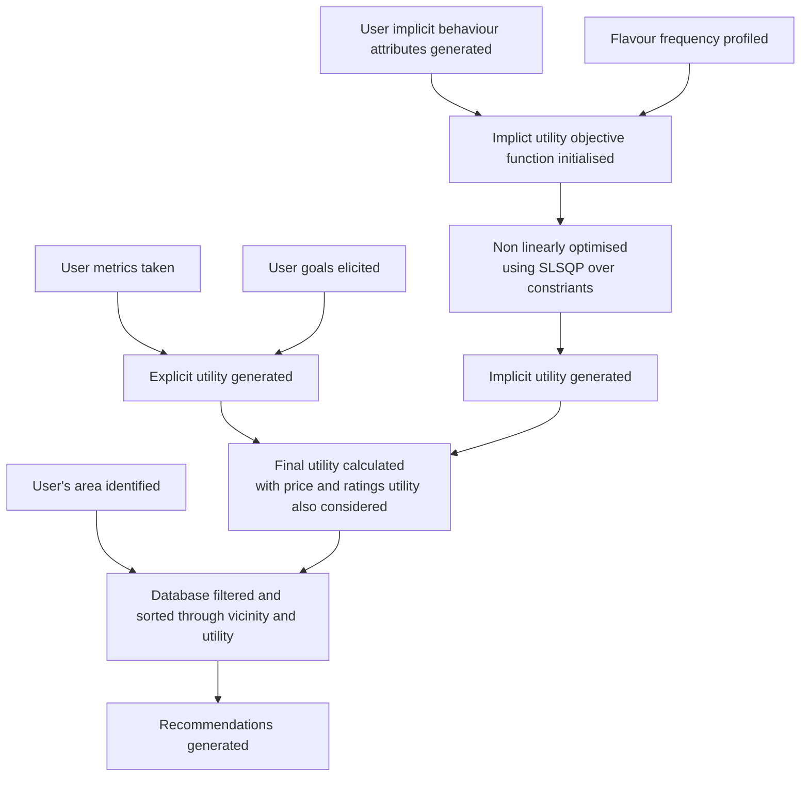

# V1
Making food recommendations easy!

## Context
Due to fast-paced and long work environments, people are struggling to pay due to attention to their meals.
Most of these meals are **ready-to-eat either delivered** by restaurants or **packaged meals** from convinience stores. 
Due to the purpose of these meals they **cannot be a substitute for a balance diet**; Especially if they are consumed without dietary planning.
This can be contributed to high amounts of calories, fat, sugar, and sodium and lack of low in nutrients, such as fiber, vitamins, and minerals.
## Our Solution
Developing a **service that integrates with E-Carts** of food order, convenience store platforms and provide nutritional insights, statistics and **recommendations**, to help consumers make healthier choices, and enhance the **user experience in this trillion dollar market**.
 
## Current Scope 
The current planned approach is to use a **temporal hybrid recommender system**, that combines collaborative filtering and Content based filtering, for time series data.

_**Update:**_
The component of collaborative filtering and content based filtering has been combined into a single implicty utilty function

## Challenges
- **Datasets**: Limited item options from particular convenience stores or restaurants limit the datasets.
- **Bypassing Variance**: Reliance on user participation can be bypassed using content based filtering.
- **Parameter Tuning**: Weighing the priority of a general healthy diet with user specialized data in forming recommendations in considerations for palette and budget.
- **Time Series Component:** Consideration of all meals consumed by the user on a daily, weekly, or monthly scale to form recommendations.

## Road map
1. Dataset generation: Fan
2. User utility generation: Based on various explicit / implicit considerations developing a user utility extraction function.
3. User requirement generatation: Calculation of explicit traits such as calorie intakes.
4. Utility function: making an accurate primary model that gives the most apt recommendations based on the extracted utility requirements of the user. Currently basing it on MAUT (Multiple Attribute Utility theory.)
5. Evalution, Testing ,Tuning till satisfaction.

## Outcomes

-The USP of the product is it aims for a more structured and healthier consumption of ready to eat, order to eat meals for regular consumers to promote a healthier lifestyle.
Therefore the outcome of the project is hopeful towards developing a model that can recommend items based on user utility in this domain.

## Technical differentiators and approach
- Currently the use of implicit utiliy based ideas replacing a hybrid collaborative-content based filter is the key differentiator.
- The precence of goal specific functions, and instance oriented temporal recommendations, to ensure accountability of user preference traits.
- Calorie metric evaluations with performance of medical institutes using in house developed [YouCal](https://github.com/FoodStats/YouCal)

## Current status 
The model is an instance based model, i.e recommendations are generated on a meal to meal basis
 1.Dataset generation: An intermediate method of using language models to judge the nutrition content and calorific count for each dish based on its description. Data is created for 1 zipcode in Dallas and 1 in Austin, texas.
 
 2.User utility generation: being generated as per need. Instead of time series, meals are being averaged out by total calories per day/ number of meals. Implicit criteria are frequency of attribute,browse time.

 3.Utility function: An IU-SLSQP (Implicit utility with Sequential Least square optimizer for non linear programming) for tastes with explicit utility for Nutrition price and rating combined over a Multi Atribute Utility Theory function (MAUTF). IU-GA (Genetic algorithm also explored)
 
 4.Evaluation: base results run, with acceptible outcomes. Basic GUI Achieved. Th

## Future Scope
 1. building an app/web interface.
 2. Building SaaS inform of API.
 3.  using the said interface for crawlers to collect implicit utility data, ie. frequency of attribute,browse time.
 4.  domain expertise oriented tokenisation of estimation of nutrition content for language model being used. Lot of scope in the fine tuning of LLM based data generation.
  > [!Tip]
  > Possible approach
  >  An approach would be to leverage a USDA datasets for individual ingredients to leverage an NLP encoder such as BERT to tokenise nutritional content based of dish discriptions/ recipes. 
 
 5. Suggestion on the model itself. Domain experts based utility functions finetuning.
 6. Introducing a long term time series component
 7. Further testing and implementation of results with real users.

 ## How can you contribute?
 1) **Data!!!** - Currently the project can massively benefit from verified nutritional data from restaurants.
> [!IMPORTANT]  
>  A huge challenge is the issue of intellectual disclosure of recipes and ingridients from the restaurants.
> Therefore Cooperation is needed.
2) **Explicit utility function contribution** - The user cases currently covered in the system are based around weight goals. Contributions are appriciated for other dietry goal related functions modelled as per the systems heurestics.
3) **Optimisation techniques** - Algebraic and genetic approaches to optimisation have been explored. Approaches for reaching better optimisations are welcome!

## Link to demo  
 https://1drv.ms/v/s!Anx0GYahDy2djxmMKHyT08unSnBZ?e=NGQrUa

